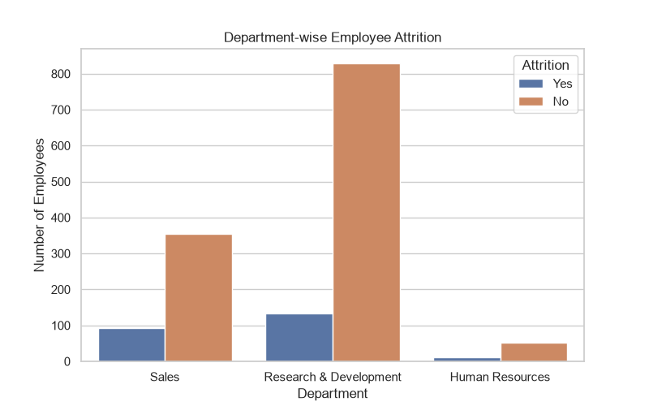
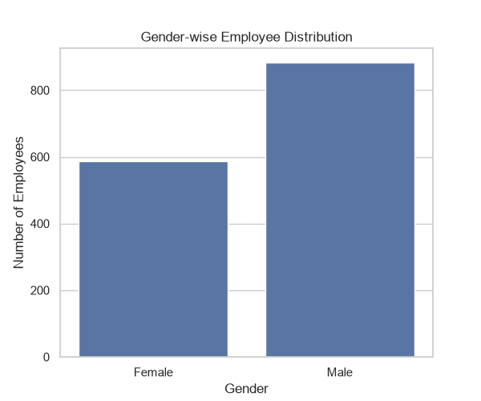
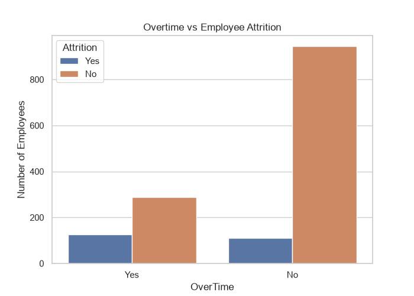
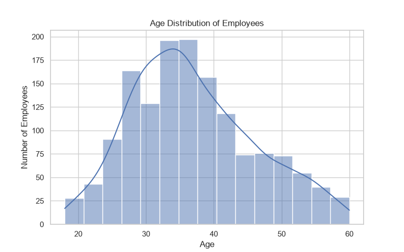
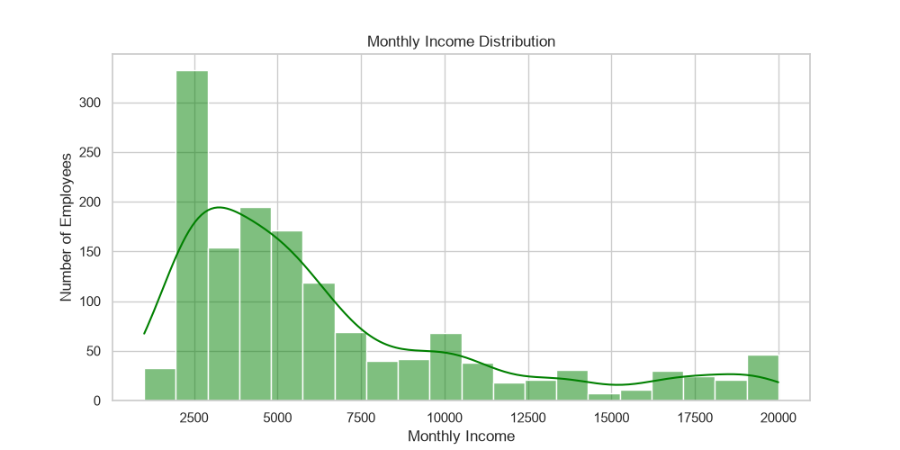
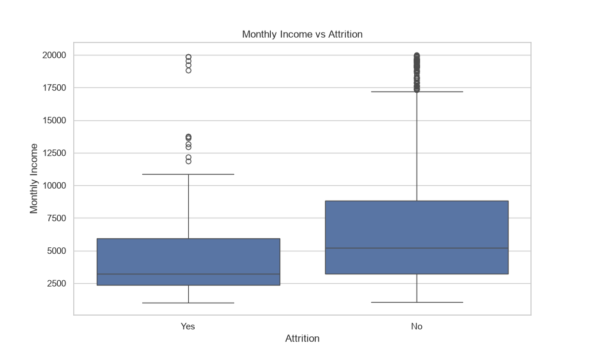
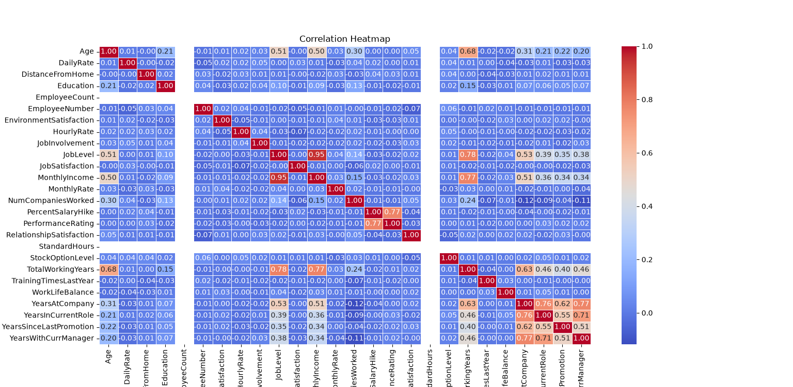
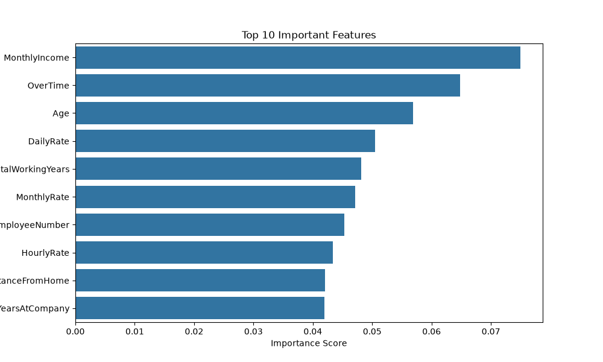

# 📊 HR Analytics – Employee Attrition Prediction using Machine Learning

<p align="center">


</p>

---

## 📌 Project Overview

Employee attrition is a critical challenge for organizations, leading to increased recruitment costs, reduced productivity, and loss of experienced talent.

This project analyzes the **IBM HR Analytics Employee Attrition Dataset** using **Python, Exploratory Data Analysis (EDA), and Machine Learning** to identify the key factors influencing employee attrition and build predictive models for employee retention.

---

# 🎯 Objectives

- Analyze employee attrition patterns.
- Perform data cleaning and preprocessing.
- Conduct Exploratory Data Analysis (EDA).
- Build predictive machine learning models.
- Compare Logistic Regression and Random Forest.
- Identify key business insights for HR decision-making.

---

# 📂 Project Structure

```
HR-Analytics-Employee-Attrition-Prediction
│
├── Data/
│   └── WA_Fn-UseC_-HR-Employee-Attrition.csv
│
├── Images/
│   ├── department_distribution.png
│   ├── gender_distribution.png
│   ├── overtime_attrition.png
│   ├── age_distribution.png
│   ├── monthly_income_distribution.png
│   ├── income_vs_attrition.png
│   ├── correlation_heatmap.png
│   └── feature_importance.png
│
├── scripts/
│   ├── hr_analytics.py
│   ├── 08_overtime_attrition.py
│   ├── 09_age_distribution.py
│   ├── 10_monthly_income_distribution.py
│   ├── 11_income_vs_attrition.py
│   ├── 12_correlation_heatmap.py
│   ├── 13_data_preprocessing.py
│   ├── 14_train_test_split.py
│   ├── 15_logistic_regression.py
│   ├── 16_random_forest.py
│   ├── 17_feature_importance.py
│   └── 18_save_model.py
│
├── hr_attrition_model.pkl
├── requirements.txt
├── README.md
└── .gitignore
```

---

# 📊 Dataset Information

| Attribute | Details |
|------------|---------|
| Dataset | IBM HR Analytics Employee Attrition |
| Records | 1470 Employees |
| Features | 35 |
| Target Variable | Attrition |

---

# 🛠️ Technologies Used

- Python
- Pandas
- NumPy
- Matplotlib
- Seaborn
- Scikit-learn
- VS Code
- Git & GitHub

---

# 📈 Exploratory Data Analysis

## 📌 Department-wise Employee Distribution



---

## 📌 Gender Distribution



---

## 📌 Overtime vs Employee Attrition



---

## 📌 Age Distribution



---

## 📌 Monthly Income Distribution



---

## 📌 Income vs Attrition



---

## 📌 Correlation Heatmap



---

# 🤖 Machine Learning Models

| Model | Accuracy |
|--------|---------:|
| Logistic Regression | **86.05%** |
| Random Forest | **86.73%** |

🏆 **Best Performing Model:** Random Forest

---

# ⭐ Feature Importance



The Random Forest model identified the following important factors influencing employee attrition:

- Monthly Income
- Overtime
- Age
- Total Working Years
- Job Level
- Environment Satisfaction
- Job Satisfaction

---

# 💡 Business Insights

- Employees working overtime are more likely to leave the organization.
- Lower monthly income is associated with higher attrition.
- Younger employees show comparatively higher attrition rates.
- Job satisfaction and work-life balance significantly influence employee retention.
- HR departments can use predictive analytics to identify at-risk employees and improve retention strategies.

---

# 📊 Model Performance

### Logistic Regression

- Accuracy: **86.05%**
- Simple and interpretable model.
- Performs well on balanced relationships.

### Random Forest

- Accuracy: **86.73%**
- Handles complex relationships effectively.
- Provides feature importance for better interpretability.

---

# 🚀 How to Run the Project

## Clone the Repository

```bash
git clone https://github.com/Manas0028/HR-Analytics-Employee-Attrition-Prediction.git
```

## Install Dependencies

```bash
pip install -r requirements.txt
```

## Run the Project

```bash
python scripts/hr_analytics.py
```

## Run Individual Scripts

```bash
python scripts/15_logistic_regression.py
python scripts/16_random_forest.py
python scripts/17_feature_importance.py
python scripts/18_save_model.py
```

---

# 📌 Project Highlights

✅ Data Cleaning & Preprocessing

✅ Exploratory Data Analysis (EDA)

✅ Feature Engineering

✅ Logistic Regression

✅ Random Forest Classifier

✅ Feature Importance Analysis

✅ Model Evaluation

✅ Saved Machine Learning Model

---

# 🔮 Future Improvements

- Hyperparameter Tuning
- XGBoost & LightGBM Models
- Streamlit Web Application
- Flask API Deployment
- Power BI Dashboard Integration
- Real-time Employee Attrition Prediction

---

# 👨‍💻 Author

**Manas Aswal**

🎓 B.Tech – Information Technology

💼 Aspiring Data Analyst

### 🔗 Connect with Me

- **GitHub:** https://github.com/Manas0028
- **LinkedIn:** *(https://www.linkedin.com/in/manas-aswal-704876288))*

---

## ⭐ If you found this project useful, don't forget to **Star ⭐ this repository!**